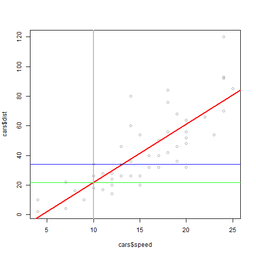

Safe Distance
========================================================
author: Pingping
date: 08/24/2020
width: 1440
height: 900

App Introduction
========================================================

- The cars dataset was first used to make the scatter plot.
- Linear regression was used to fit the data.
- The linear model was then used to predict the safe distance at different speeds.

The Safe Distance app could predict the safe ditance at different input speed, and display the output using interactive plots.


UI.R and Server.R 
========================================================
 
- ui.R and server.R files were created
- The ui file controls the lauyout of the shiny app
- The server file controls the function of the shiny app


Example: speed equals to 10
========================================================

```r
plot(x= cars$speed, y = cars$dist, col = 'darkgray')
lmfit <- lm(cars$dist~cars$speed)  
abline(lmfit, lwd = 2, col = "red")
abline(v = 10, lwd = 2, col = "grey")
abline(h = max(as.vector(cars[cars$speed == 10, ]$dist)),  col = "blue")
abline(h = lmfit$coefficients[[1]]+10*lmfit$coefficients[[2]], col = "green")
```



Links
========================================================
- The ui.R file could be found at: https://github.com/pmeng2/Developing_Data_Products_CourseProject/blob/master/ui.R
- The server.R file could be found at: https://github.com/pmeng2/Developing_Data_Products_CourseProject/blob/master/server.R
- The web app could be found at: https://pmeng2.shinyapps.io/Developing_Data_Products_CourseProject/
